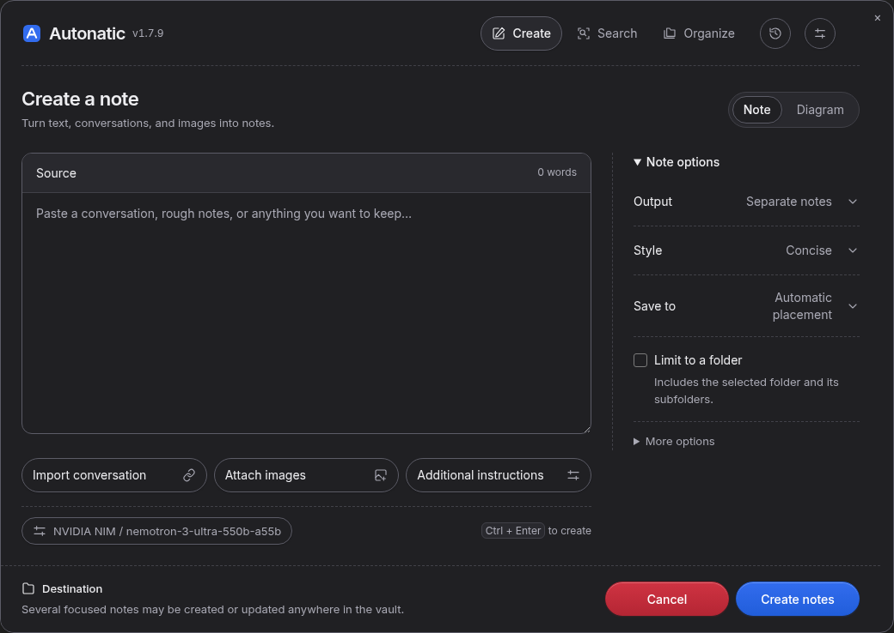
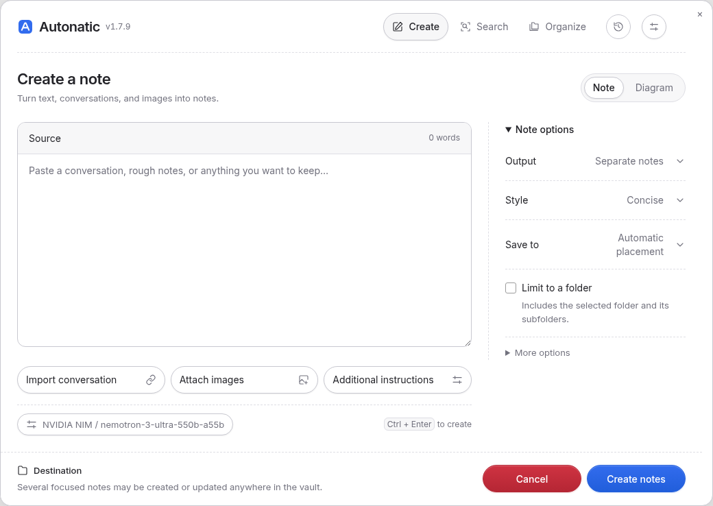

# Autonatic — Obsidian plugin

Turn text, shared AI conversations, and images into structured Markdown notes. Search original passages and organize your vault from the same workspace.

**Current version:** 1.7.11 · **Requires:** Obsidian 1.13.1 or newer on desktop.

## AI providers

- **Generation providers:** OpenAI, Google Gemini, Anthropic Claude, Groq, OpenRouter, and NVIDIA NIM.
- **Embedding providers:** OpenAI, Google Gemini, OpenRouter, and NVIDIA NIM. Claude and Groq do not expose a compatible embedding endpoint.

## Features

- **AI Integration**: Select separate providers for generation and embeddings, with individual API keys and model IDs.
- **The Obsidian Way Skill Prompt**:
  - **Optional YAML Properties / Frontmatter**: Opt in to generated `title`, `aliases`, `tags`, `created`, `summary`, and `status` metadata.
  - **Callouts**: Strategic use of `> [!summary]`, `> [!info]`, `> [!tip]`, `> [!warning]`.
  - **Wikilinks**: Auto-links related concepts `[[Topic]]` for Obsidian Graph View connectivity.
  - **Structure**: Clear headings, bold lead-in bullet points, tables, and mermaid diagrams.
- **Note creation and editing**:
  - **One note**: Keep the source together in one note.
  - **Separate notes**: Split the source into focused notes by topic.
  - **Add to active note**: Append a section to the open note.
  - **Save to**: Choose automatic placement or a specific folder. Automatic placement can reuse existing notes or create new notes and folders. Existing folder lists guide organization; they do not restrict new destinations.
  - **Highlighted-text edits**: Improve, expand, or regenerate only the selected Markdown in the editor.
- **Bare source-only style**: Cleans pasted browser chat history into Markdown without expanding, inferring, summarizing, or adding new material. Source code and diagrams keep their syntax, and appends do not add timestamp or reason callouts.
- **STE-inspired technical writing**: Concise and Detailed use short sentences, direct verbs, consistent technical terms, and explicit conditions. Code, identifiers, paths, quotations, numbers, and uncertainty are preserved. Provider reasoning explanations receive guidance for clear evidence and decision reasons; the plugin does not claim full ASD-STE100 compliance.
- **Source-faithful writing styles**: Concise and Detailed preserve the supplied material, with headings, callouts, tables, and diagrams used only when useful. To include outside knowledge, explicitly request it in the custom instruction; additions are labeled **Additional context**. Bare always stays within the source.
- **Shared conversation import**: Paste a Gemini, ChatGPT, or Claude share link into Note Crafter to load every visible turn into the source field. Review it before generating one or several notes. Images and other attachments remain linked to the original shared page.
- **Automatic placement across long sources**: Match separate conversation topics against the local vault index so repeated early topics do not hide later ones. Before appending, compare the proposed addition with the current target note and skip material already covered.
- **Background generation**: Choose **Continue in background**, then reopen Autonatic to return to the same live progress, reasoning, and preview. Cancel remains available after reopening. A failed background task retains its draft and error for review.
- **Folder choices in the generation request**: Multi-note generation decides folders alongside the notes. Placement validates paths locally without additional folder-planning model calls. Failed saves can retry the completed draft.
- **Topic-based note boundaries**: A long existing note stays together when new material belongs there. Generation no longer creates numbered Part or Continued notes when a word count is crossed.
- **Organize notes**: Describe a folder structure in plain language, such as grouping by programming language and then OS, HTTP, or security. The AI can propose new folders and subject branches; applying the reviewed plan creates missing destination folders. Review every proposed note move before applying it. Each arrangement saves a path snapshot that you can restore later.
- **Interactive UI**:
  - Ribbon icon for one-click access.
  - A shared design system with bundled Inter typography, rounded navigation, outlined buttons, right-aligned option values, and fine dashed dividers. Its neutral palette switches with Obsidian's light or dark appearance.
  - A tinted **Source** header with a word count, three separate source-tool buttons, and a connected **Note / Diagram** switch.
  - **History** beside Settings for generation undo/redo and recent prompts. The control appears when history is available.
  - A persistent destination summary, blue create actions, red Cancel, and collapsible options in narrow windows. Create, Search, and Organize share navigation; returning from another tool preserves the open draft.
  - Rendered Markdown live preview with collapsible generated source and reasoning.
  - Optional folder scope for Smart Placement. Smart can create or append only in the selected folder and its subfolders.
  - Settings grouped into Providers, Creation, Search, Privacy, and Advanced, with keyboard navigation.
- **Ask Notes**: Find original passages with links to their notes. Exact term lookups can return from the local index. Natural-language questions combine whole-word and identifier matching with embeddings from the selected provider. Results use rarity-weighted text ranking and reciprocal-rank fusion; weak semantic candidates are filtered. Search never generates an answer; the passage and vector index stays in device-local IndexedDB outside the vault. No model runs locally.
- **Adaptive Excalidraw Diagrams**:
  - Automatic mind map, flowchart, architecture, timeline, decision-tree, and comparison selection.
  - Automatic note workflows finish note placement first. A usefulness check then creates, updates, or skips focused diagrams.
  - Compact, balanced, and detailed modes with node limits.
  - Left-to-right or top-to-bottom flow layouts.
  - Dark and light canvas themes.
  - Validated connections, stable element IDs, source-heading links, and local content-based fallback diagrams.

## Interface

The Create workspace in dark mode:



<details>
<summary>Light appearance</summary>



</details>

**Import conversation**, **Attach images**, and **Additional instructions** sit beside each other when space allows. Their forms expand below the buttons. On smaller windows, controls wrap or stack and the options inspector collapses. The loaded plugin version appears beside the Autonatic name.

## Installation and updates

1. Download `main.js`, `manifest.json`, `styles.css`, and `versions.json` from a [release](https://github.com/FreyGold/autonatic/releases), or build them from source.
2. Place the four files in your vault's `.obsidian/plugins/nemotron-note-crafter/` directory. Use your vault's configuration folder if it has a different name.
3. Reload Obsidian and enable **Autonatic** under **Settings > Community plugins**.

For an update, replace those four files, keep `data.json` with your saved settings, and toggle Autonatic off/on. Check the version beside the plugin name to confirm the new build has loaded.

## How to use

1. Open **Settings > Autonatic > Providers**. Choose a generation provider, add its API key, fetch available models, and select a **Chat model**. Choose an **Image model** if you want to read attached images.
2. Click the **Autonatic icon** in the ribbon, or open the command palette with `Ctrl/Cmd+P` and run **Autonatic: Open Note Crafter Modal**.
3. Choose **Note** and paste your material into **Source**. Use **Import conversation**, **Attach images**, or **Additional instructions** as needed.
4. Use **Note options** to choose **One note**, **Separate notes**, or **Add to active note**. Choose a writing style, then use **Save to** for automatic placement or a specific folder. On narrow windows, expand **Note options** or click **Change output** in the footer.
5. Review the destination summary and click the create button, or press **Ctrl/Cmd+Enter**.

In a folder picker, use **New folder** to create a child folder. If a typed path doesn’t exist, the picker shows **Create folder**; click it or press Enter in **Path** to confirm creation. Nested paths create missing parent folders too. The picker selects the resulting folder after confirmation.

For a shared AI chat, choose **Share** in Gemini, ChatGPT, or Claude, expand **Import conversation**, paste the conversation link, and click **Import**. The plugin uses an installed Chrome, Chromium, Edge, or Brave browser to load the shared snapshot, then fills **Source** so you can review or edit it before generating notes. Workspace-restricted links may require sign-in and cannot be imported automatically. If link import fails, open the shared page in your browser and copy its conversation text into **Source**. Do not create a public link for a chat that contains sensitive material.

Choose **Diagram** to create an Excalidraw drawing from the active note or a new description. Use **Diagram options** to choose its type, detail, direction, theme, and destination.

The **History** icon beside Settings opens undo, redo, and recent prompts. You can also run **Undo Last Generation** or **Redo Last Generation** from the command palette. Undo checks for later note changes before restoring a generation.

To edit part of an existing note, highlight the text and open the editor context menu. Use an **Autonatic** command. The plugin replaces only the highlighted text.

To search your notes, choose an embedding provider and model under **Settings > Autonatic > Providers**. In the **Search** settings, include the folders you want searchable and enable **Ask Notes**. Indexing sends selected Markdown text to that provider for embeddings. Then choose **Search** in the workspace, use **Ctrl+Shift+H** (or **Cmd+Shift+H** on macOS), or run the **Ask Notes** command. You can change the shortcut in Obsidian Hotkeys. Modified notes update in the background; Search settings also provide pause, rebuild, and clear controls.

To rearrange existing Markdown notes, choose **Organize** in the workspace or run the **Organize Notes and Manage Arrangement Snapshots** command. Describe the primary grouping and any priorities, optionally limit the scope to one folder, then click **Plan arrangement**. The preview lists each proposed destination and flags path conflicts. Click **Apply** only after reviewing the moves. **Saved arrangements** lets you review and restore the original paths later. A snapshot records paths, not note contents: edits and newly created notes remain, and a deleted note cannot be recovered from it. Restore stops if a destination is occupied or a tracked note is missing. The snapshot file lives in your vault's Obsidian plugin configuration directory.

## Settings

Open **Obsidian Settings > Autonatic** or click the Settings icon in the workspace.

| Tab | Controls |
| --- | --- |
| **Providers** | Generation and embedding providers, API keys, available models, image model, and custom API URLs. |
| **Creation** | Default output, writing style, folder, placement index, destination review, YAML properties, and automatic diagrams. |
| **Search** | Included folders, Ask Notes consent, background indexing, and local index rebuild/clear. |
| **Privacy** | Excluded folders, remote placement summaries, context limits, multi-file confirmations, and diagram limits. |
| **Advanced** | Reasoning, temperature, Top P, token limit, and custom Concise/Detailed prompts. |

## Privacy and cost

This is a desktop-only plugin. Generation sends your prompt and selected vault context to the configured generation provider. Automatic appends make an additional request containing the proposed addition and the target note's contents, or selected excerpts when the target is long. Remote placement indexing is off by default. Ask Notes has separate consent and indexes only included Markdown folders, subject to excluded folders. Its embeddings, stored passages, and search metadata remain on this device and are not placed in the vault. Semantic searches send the query to the configured embedding provider. Search results show original note passages without an answer-generation request. Providers can charge for each request.

Organize notes sends eligible note paths, titles, tags, and short summaries to the configured generation provider for planning. Excluded folders and hidden paths are omitted. The arrangement snapshots are saved locally in the plugin configuration directory.

## Development

Build the plugin from source:

```sh
npm ci
npm run check
npm run build
```

The release files are `main.js`, `manifest.json`, `styles.css`, and `versions.json`. A pushed tag starts the release workflow, which checks and builds the plugin before publishing those files.

The [design system](docs/design-system.md) defines the shared typography, palette, spacing, and components. Edit the CSS modules in `src/ui/`; `npm run build` generates `styles.css` and embeds the licensed Inter font. `npm run dev` watches both the TypeScript and CSS sources.

The [prompt policy](docs/prompt-policy.md) describes writing rules, source boundaries, folder permissions, reasoning explanations, and migration of saved defaults.
